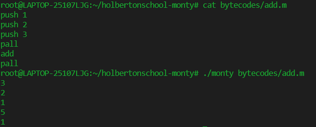
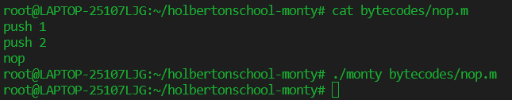
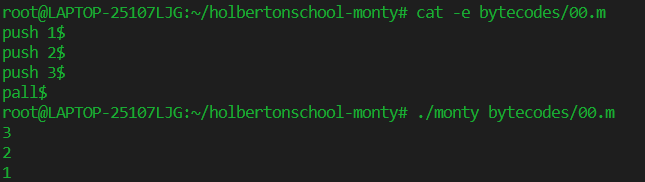
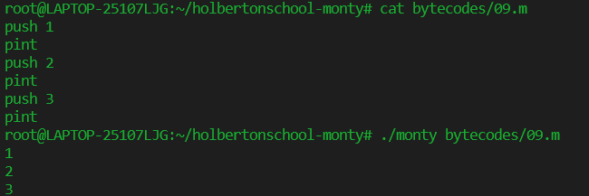
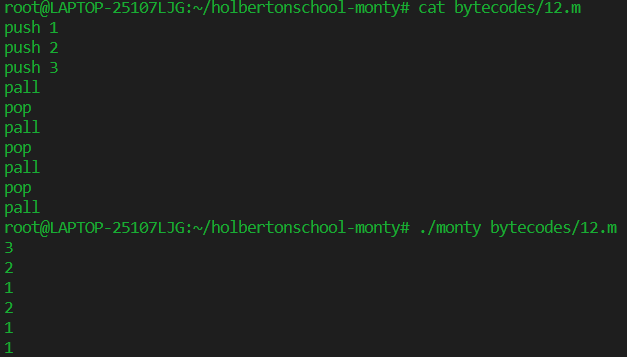
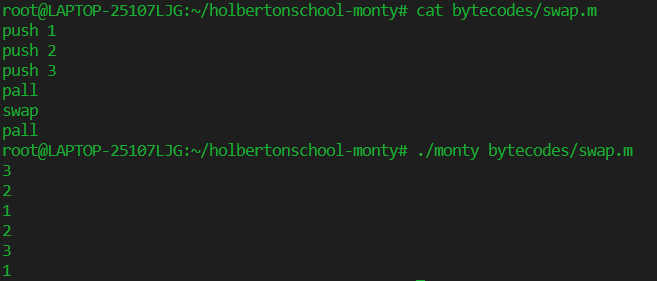

# **Project Monty**

Create an interpreter for Monty ByteCodes files.

## **Team and Tasks**

This project was released by Emma Lateyron and Marion Laroche in Holbertonschool's Bordeaux.
We divided most of the tasks but the main file 'monty.c' was written in collaboration.
Monty 0.98 is a scripting language that is first compiled into Monty byte codes (Just like Python). It relies on a unique stack, with specific instructions to manipulate it, like push, pall...

## **Compilation**

gcc -Wall -Werror -Wextra -pedantic *.c -o monty

## **Files**

| file | description |
|-----:|-------------|
| _add.c | Function _add : adds the top two elements of the stack. |
| _nop.c | Function _nop : doesn't do anything. |
| _pall_and_push.c | Function _pall : prints all the values of the stack. Function _push : pushes an element to the stack. |
| _pint.c | Function _pint : prints the value at the top of the stack. |
| _pop.c | Function _pop : removes the top element of the stack. |
| _swap.c | Function _swap : swaps the top two elements of the stack. |
| check_opcode.c | Function co : chooses the function corresponding to the command entered. |
| free_stack.c | Function free_stack : frees a stack. |
| monty.c | Main function. |
| monty.h | Header file containing all prototypes and structures. |

## **Examples**

Add command :  
  
Nop command :  
  
Push and pall command :  
  
Pint command :  
  
Pop command :  
  
Swap command :  

## **Authors**

Laroche Marion [Github](https://github.com/Mamuche).

Lateyron Emma [Github](https://github.com/emma-33).
